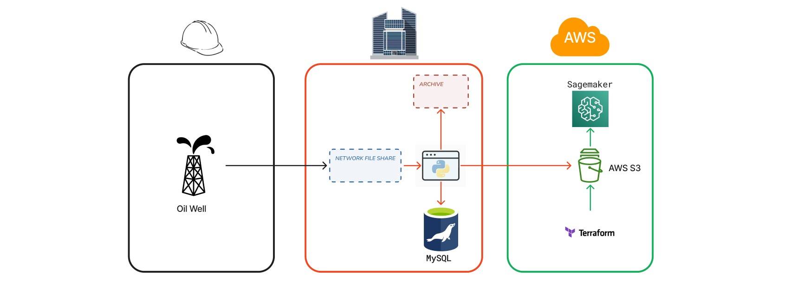
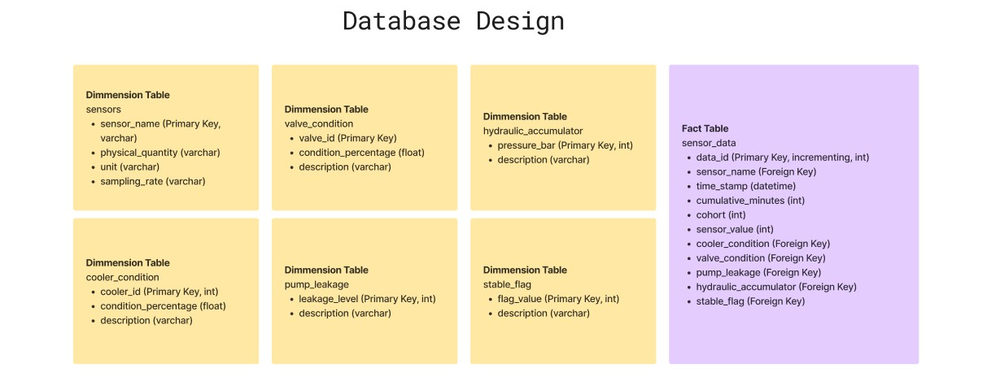

  

Data Career Jumpstart - unguided project

## Project Prompt:
Oil wells can make $500,000+ / day, so these machines are highly valuable. Making sure we run them with data will be huge for our company. 

The data set comes from a real hydraulic rig system. This hydraulic rig is used to drill oil out of the ground. It has 4 main controls: the cooler setting, the valve setting, the pump setting, and the accumulator setting. The rig has sensors in different areas measuring the pressure, volumetric flows, and temperatures.

The technicians have been storing the oil well tests in text files locally, the data scientists would like to review the data but it's not in an ideal format. 
1. Convert the files to CSV for the data scientist.
    * See the example template CSV for the desired format.
    * Merge profile data.
3. Migrate the data to a database for future use.
4. Complete missing data:
    * Add a date-time column.
    * The data is considered as recorded every 60 minutes for project purposes. 
        * Provide cumulative 60-minute intervals.
    

### Starting Knowledge
1. There are 15 years' worth of data.
2. The start date is 3/26/2008.
3. Data collection:
    * All changes must be done after you receive the data.
    * The data is collected in 3-month cohorts starting at midnight on the first day. 
    * The last day will be a few hours short for scheduled maintenance after each cohort.
4. There is only one profile.txt, reuse the data for each cohort.
5. The scientists use AWS Sagemaker.

## System Design
* Data: 
    * Currently in table format and is tab-delimited.
    * Used internally.
        * Consistent load.
        * Limited access.
    * Does not meet the requirements of big data.
        * Big data 6V's (volume, value, variety, velocity, veracity, and Variability)
    * Data is provided in 3-month batches/cohorts.
    * Data scientists need access to CSV format and use AWS Sagemaker.
    * SOLUTION: Use the current onsite MySQL. Database: `energymobile`
        * REASON: The limited data volume and limited use do not justify cloud expense when cheap local storage is available. 
    * SOLUTION: Export a CSV from the database and import it to an S3 bucket. CSV: `oil-well-data-all-historical`
        * REASON: S3 will allow Sagemaker to have access to the data and CSV is the desired format. Creating the CSV from a database query is more efficient than scripting a program to create a combined CSV from the text files.
* Database schema:
    * [Figjam](https://www.figma.com/file/wblGp1sxj3uJhKLCxmVHuY/energymobile---database-design?type=whiteboard&node-id=0-1&t=oId6SLpAnpLL8sIR-0) (see Snowflake schema below)
* Process flow:
    * Initial: Manual batch processing to get historical data into production.
    * Future state: Schedule processing at the end of every cohort. Additional clarification is needed from operations.
        * Is there a lag time in data availability once the cohort completes?
        * Can the data be provided at a set date and time?
        * Can the format or information be modified by the sending system?

# Implementation
###### Infrastructure

1. Run the `db_creation.sql` query; create the database in MySQL.
1.  Create an AWS S3 bucket using AWS command line / Terraform with `s3-terraform.tf`.
###### ETL
1. Import the oil well sensor logs into the logs folder and import the profile file into the profile folder.
1. Run the `tab-to-csv.py` script; converts sensor logs to CSV.
1. Run the `profile-csv.py` script; converts the profile file to CSV.
1. Run the `import-mysql.py` script; import the log and profile CSV data to MySQL.
1. Run the `export_from_db.sql` query in MySQL and save the output as a CSV to the aws_s3 folder.
1. Run the `aws-upload.py` script; Uploads the database export CSV to the aws s3 folder.
1. Run the `archive.py` script; archives the log, profile, and AWS directory CSVs.

